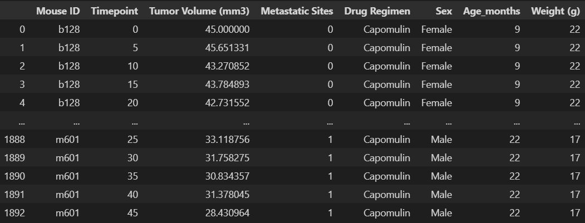
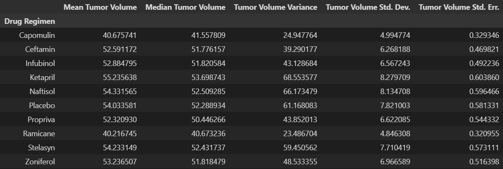
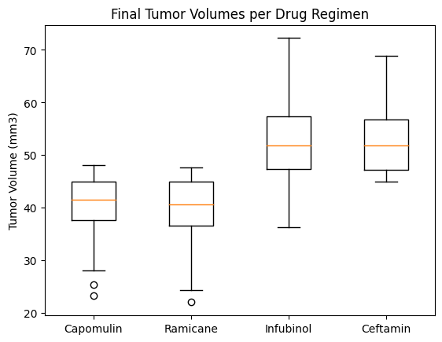
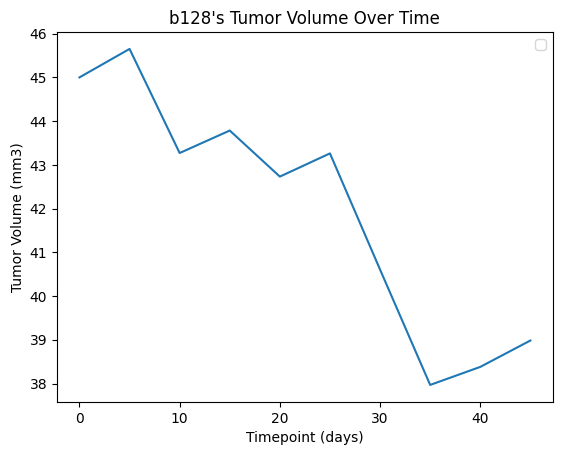
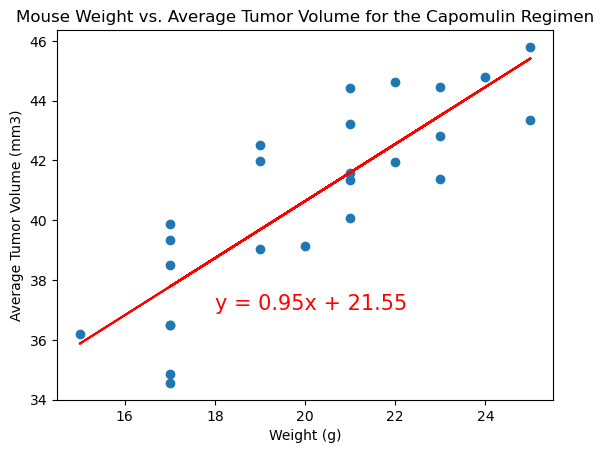
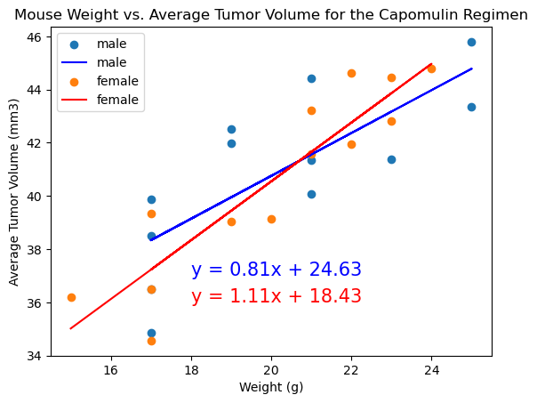

# plotting-challenge
## Andrew Lounsbury
Module 5 challenge for the Vanderbilt Data Analytics Bootcamp

# Code from pandas.pydata.org and the instructors
The cell 
```
# Getting the duplicate mice by ID number that shows up for Mouse ID and Timepoint. 
# https://pandas.pydata.org/docs/reference/api/pandas.DataFrame.duplicated.html
smaller_data = data_complete[["Mouse ID", "Timepoint"]]
duplicate = smaller_data.loc[smaller_data.duplicated(subset=["Mouse ID", "Timepoint"]), "Mouse ID"].unique()
duplicate
```
contains a function that is demonstrated on [this website](https://pandas.pydata.org/docs/reference/api/pandas.DataFrame.duplicated.html) and was explained by our instructors. 

# Data





```text
The lower quartile for Capomulin is 37.685932865.
The upper quartile for Capomulin is 45.0.
The interquartile range for Capomulin is 7.314067135000002.
The lower bound for Capomulin is 26.714832162499995.
The upper bound for Capomulin is 55.9711007025.
Capomulin's potential outliers: 155    25.472143
156    23.343598
Name: Tumor Volume (mm3), dtype: float64

The lower quartile for Ramicane is 36.674634585.
The upper quartile for Ramicane is 45.0.
The interquartile range for Ramicane is 8.325365415.
The lower bound for Ramicane is 24.1865864625.
The upper bound for Ramicane is 57.488048122500004.
Ramicane's potential outliers: 136    22.050126
Name: Tumor Volume (mm3), dtype: float64

The lower quartile for Infubinol is 47.3123533.
The upper quartile for Infubinol is 57.314443967500004.
The interquartile range for Infubinol is 10.002090667500006.
The lower bound for Infubinol is 32.309217298749985.
The upper bound for Infubinol is 72.31757996875001.
Infubinol's potential outliers: Series([], Name: Tumor Volume (mm3), dtype: float64)

The lower quartile for Ceftamin is 47.2084271125.
The upper quartile for Ceftamin is 56.801437570000004.
The interquartile range for Ceftamin is 9.593010457500007.
The lower bound for Ceftamin is 32.81891142624998.
The upper bound for Ceftamin is 71.19095325625001.
Ceftamin's potential outliers: Series([], Name: Tumor Volume (mm3), dtype: float64)
```









### Analysis
- These tests were administered to about the same number of male and female mice. 
- The drug regimens administered to the greatest numbers of mice were Capomulin and Ramicane. However, we did find outliers among the tumor volumes for both of these treatments. 
- Mouse b128, a subject of the Capomulin regimen, showed a drastic decrease in tumor volume over the course of her treatment. 
- The median tumor volume for Capomulin and Ramicane (41.56mm3 and 40.67mm3, respectively) were lower than the median tumor volumes of all other treatments. 
- For the Capomulin regimen, heavier mice were linearly correlated with tumors of greater volume, with a fairly high r-value of about 0.84. This begs the question of whether or not male or female mice tend to be heavier and therefore more prone to larger tumors; although, in these experiments the average weight of male mice, 19.84g, happened to be slightly less than the average weight of female mice, which was 20.06g. We see the same difference over all mice from all treatment regimens. The average weight of male mice overall was 25.42g, and the average weight of female mice overall was 25.91g. Also, for the Capomulin regimen, we found that the correlation between weight and Average Tumor Volume was stronger for female mice, with an r-value of 0.91, than the same correlation for male mice, which had an r-value of 0.77. 