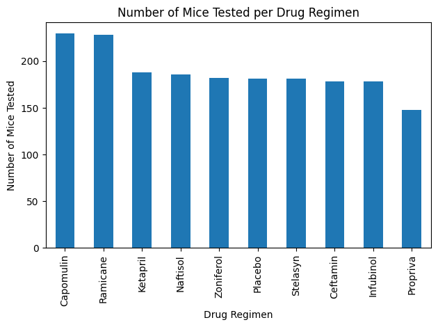

# plotting-challenge
## Andrew Lounsbury
Module 5 challenge for the Vanderbilt Data Analytics Bootcamp

# Code from statology.org
The cell 
```
# Getting the duplicate mice by ID number that shows up for Mouse ID and Timepoint. 
# https://www.statology.org/pandas-find-duplicates/
duplicate = data_complete[data_complete.duplicated()]
duplicate
```
contains a function demonstrated on [this website](https://www.statology.org/pandas-find-duplicates/). 

# Data





```text
The lower quartile for Capomulin is 37.685932865.
The upper quartile for Capomulin is 45.0.
The interquartile range for Capomulin is 7.314067135000002.
The lower bound for Capomulin is 26.714832162499995.
The upper bound for Capomulin is 55.9711007025.
Capomulin's potential outliers: 155    25.472143
156    23.343598
Name: Tumor Volume (mm3), dtype: float64

The lower quartile for Ramicane is 36.674634585.
The upper quartile for Ramicane is 45.0.
The interquartile range for Ramicane is 8.325365415.
The lower bound for Ramicane is 24.1865864625.
The upper bound for Ramicane is 57.488048122500004.
Ramicane's potential outliers: 136    22.050126
Name: Tumor Volume (mm3), dtype: float64

The lower quartile for Infubinol is 47.3123533.
The upper quartile for Infubinol is 57.314443967500004.
The interquartile range for Infubinol is 10.002090667500006.
The lower bound for Infubinol is 32.309217298749985.
The upper bound for Infubinol is 72.31757996875001.
Infubinol's potential outliers: Series([], Name: Tumor Volume (mm3), dtype: float64)

The lower quartile for Ceftamin is 47.2084271125.
The upper quartile for Ceftamin is 56.801437570000004.
The interquartile range for Ceftamin is 9.593010457500007.
The lower bound for Ceftamin is 32.81891142624998.
The upper bound for Ceftamin is 71.19095325625001.
Ceftamin's potential outliers: Series([], Name: Tumor Volume (mm3), dtype: float64)
```


### Analysis
- These tests were administered to about the same number of male and female mice. 
- The drug regimens administered to the greatest numbers of mice were Capomulin and Ramicane. Hence, results yielded by these treatments were perhaps the more reliable than others. 
- Mouse b128, a subject of the Capomulin regimen, showed a drastic decrease in tumor volume over the course of her treatment. 
- We found outliers among the tumor volumes for both the Capomulin and Ramicane treatments, and yet the median tumor volume for each treatment (41.56mm3 and 40.67mm3, respectively) were lower than the median tumor volumes of all other treatments. 
- Heavier mice were linearly correlated with tumors of greater volume. 